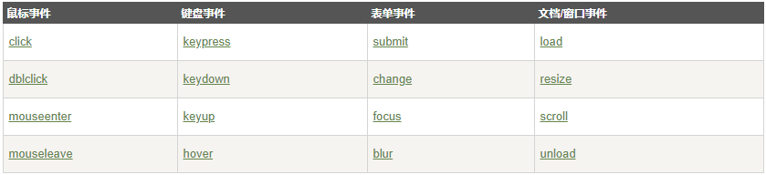

jquery基础知识储备：
    什么是jquery？
        1.jQuery是一个JavaScript函数库。
        2.jQuery是一个轻量级的"写的少，做的多"的JavaScript库。
        3.jQuery库包含以下功能：
            HTML 元素选取
            HTML 元素操作
            CSS 操作
            HTML 事件函数
            JavaScript 特效和动画
            HTML DOM 遍历和修改
            AJAX
            Utilities
    提示： 除此之外，Jquery还提供了大量的插件。
        jQuery团体知道JS在不同浏览器中存在着大量的兼容性问题，目前jQuery兼容于所有主流浏览器, 包括Internet Explorer 6!
    jQuery 语法
        jQuery 语法是通过选取 HTML 元素，并对选取的元素执行某些操作。
        基础语法： $(selector).action()
        美元符号定义 jQuery
        选择符（selector）"查询"和"查找" HTML 元素
        jQuery 的 action() 执行对元素的操作
        实例:
        $(this).hide() - 隐藏当前元素
        $("p").hide() - 隐藏所有 
 元素
        $("p.test").hide() - 隐藏所有 class="test" 的 
 元素
        $("#test").hide() - 隐藏所有 id="test" 的元素
    jQuery 选择器
        jQuery 选择器允许您对 HTML 元素组或单个元素进行操作。
        jQuery 选择器基于元素的 id、类、类型、属性、属性值等"查找"（或选择）HTML 元素。 它基于已经存在的 CSS 选择器，除此之外，它还有一些自定义的选择器。
        jQuery 中所有选择器都以美元符号开头：$()。
    jQuery 事件
        
        click:点击事件
        dblclick:双击事件
        mouseenter:鼠标穿过元素时触发事件
        mouseleave:当鼠标指针离开元素时，会发生 mouseleave 事件
        mousedown:当鼠标指针移动到元素上方，并按下鼠标按键时，会发生 mousedown 事件
        mouseup:当在元素上松开鼠标按钮时，会发生 mouseup 事件
        focus:当元素获得焦点时，发生 focus 事件
        blur:当元素失去焦点时，发生 blur 事件